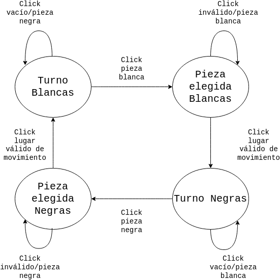
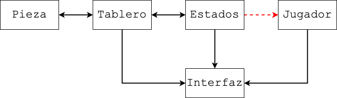

# Magnus the G.O.A.T

Para el que no conoce al crack: [https://en.wikipedia.org/wiki/Magnus_Carlsen](https://en.wikipedia.org/wiki/Magnus_Carlsen)

Y Magnus derrotando a jugadores de alto nivel con unas copas encima: [https://www.youtube.com/watch?v=K-Kz7bo5tKE](https://www.youtube.com/watch?v=K-Kz7bo5tKE)

Recuerden instalar pygame y pytest! `pip install pygame` y `pip install pytest`.

## Reglas de juego

Para hacer este ejercicio, tienen que saber como se mueven las piezas de ajedrez y como se cuentan los puntos. Esto se encuentra libremente en internet. Para el último punto tienen que semi entender un jaque, ¡Consulten!

En este ajedrez rudimentario no tomamos en cuenta:

- Promoción de fichas (peón a reina u otras fichas)
- Enroque
- Algunas condiciones de empate: *Dead Position*, *Threefold Repetition* y *50-Move Rule*.

Sin embargo, con el diseño con objetos, ¡Al finalizar el ejercicio puede que se imaginen como implementar esas funciones!

## Especificaciones del programa

El programa cuenta con distintos archivos que tienen distintas partes del programa

### Ajedrez

Este archivo cuenta con todo lo necesario para correr la interfaz gráfica. Usa la librería pygame, y es el archivo que tienen que correr para ver la interfaz. A diferencia de todo el resto del programa, está pensado más con una lógica funcional que con P.O.O.

### Tablero

Define la clase tablero a ser usada en el juego. Cuenta con diversos métodos para obtener y mover piezas. No hace falta que le realicen ninguna modificación.

**IMPORTANTE:** Las posiciones `(x,y)` en el tablero no son las tradicionales de los ejes cartesianos. `x` es fila e `y` columna, por lo tanto, `x` sería el eje vertical e `y` el horizontal.

### Lógica

Cuenta con la lógica de máquina de estados necesaria para el desarrollo del juego. Van a tener que modificar algunas cosas para los últimos dos puntos. Dejo la lógica de los estados a continuación:

### Piezas

Declaración y lógica de las piezas de ajedrez. Hay alguna piezas ya hechas, y otras que tiene que completar/arreglar en ciertos puntos de la consigna.

### Jugador

Declaración y constructor incompleto de la clase `Jugador`, a ser completada en el punto de la consigna correspondiente.

### Tests

Están los tests separados en 2 archivos, para que no sea un mega archivo y mas o menos se separen por temas, pero pueden correr todos juntos con `python -m pytest`. Pueden correr tests individuales usando los comandos que se incluyen en cada punto de la consigna.

## Consigna

### Movimiento Piezas

Para este ejercicio, pueden asumir que la pieza está en la posición que dice estar, y que las posiciones son válidas (es decir, no caen fuera del tablero).

#### Alfil

Github Copilot sugirió una solución para implementar el movimiento del alfil, que es la que está en el archivo. Sin embargo, esta no anda. Revisando en internet, el siguiente foro de matemática sugiere la siguiente solución a ese problema: [https://math.stackexchange.com/questions/1566115/formula-that-describes-the-movement-of-a-bishop-in-chess](https://math.stackexchange.com/questions/1566115/formula-that-describes-the-movement-of-a-bishop-in-chess). Arreglar/Rehacer el método `is_valid_move` del alfil. Recordamos que el alfil se mueve diagonalmente sin saltar piezas.

Para correr **SOLO** los tests del alfil, usar `python -m pytest test_piezas.py::TestBishop`.

#### Torre

¡La torre no sabe moverse! Completar el método `is_valid_move` de la torre para que sepa como hacerlo. Recordamos que la torre se mueve horizontalmente y verticalmente sin saltar piezas. **TIP:** Pueden usar el principio de la solución del alfil para hacer algo parecido. ¡Tal vez convenga partir en movimiento horizontal y vertical por separado!

Para correr **SOLO** los tests de la torre, usar `python -m pytest test_piezas.py::TestRook`

#### Reina

Ahora, con lo que hicimos con la torre y el alfil, completar el método `is_valid_move` de la reina. Recordamos que la reina se mueve horizontalmente, verticalmente y diagonalmente sin saltar piezas.

Para correr **SOLO** los tests de la reina, usar `python -m pytest test_piezas.py::TestQueen`

### Jugadores

#### Puntos

De los jugadores no sólo nos importa el color, si no también los puntos y las piezas que fue capturando. Para eso, completen la clase `Jugador` que:

- Se inicialice con el color (white/black)
- Tenga un método points que devuelva los puntos del jugador, que se calculan en base a  las piezas capturadas del oponente:
  - 1 por peón
  - 3 por alfil o caballo
  - 5 por torre
  - 9 por reina
- Tenga un método `capture_piece` que reciba una pieza y la capture.
- Tenga un método `captured_pieces` que no tome parámetros y devuelva una lista de las piezas capturadas por dicho jugador.

Para correr **SOLO** los tests de los puntos, usar `python -m pytest test_jugador.py::TestPoints`

#### Lógica de Juego

Lo siguiente es un diagrama de como interactúan las distintas partes del juego:

Como muestra el diagrama, falta la conexión entre la lógica de juego (máquina de estados) y el jugador. En particular, los estados deberían informarle a los jugadores las piezas que van siendo capturadas. Es por eso que la interfaz no refleja ni los puntos ni las piezas capturadas, es información que va a buscar al jugador y el jugador no tiene. Para eso, deben modificar dichos estados (`logica.py`) para que el jugador reciba las piezas que va capturando. Piensen, ¿En qué estado tiene sentido que el jugador capture una pieza? **TIP:** Los jugadores están en los atributos `player` y `oponent` del estado.

Para correr **SOLO** los tests del estado, usar `python -m pytest test_jugador.py::TestPieceCapture`

#### Final del juego

En este momento el juego no termina ni tiene en cuenta jaques. Modificar los estados para que:

- No permita un movimiento válido de piezas si implica quedar en jaque
- Terminar el juego (osea pasar al estado `GameEnd`) cuando se hace un movimiento válido que implica jaque mate o empate. El player es quien efectuó el movimiento final, no se rota como en `TurnStart`.

**IMPORTANTE:** No tienen que hacer todo de 0. `GameEnd` ya está hecho, y el tablero cuenta con un montón de métodos que les pueden servir, como `isChecked`, `isCheckmate`, `isStalemate` y otros. Vean las declaraciones de los métodos para ver que toman de parámetro y que devuelven.

Para correr **SOLO** los tests del estado del juego, usar `python -m pytest test_estado.py`.

## Calificación

El tp no tiene nota numérica, pero es obligatorio para aprobar el año. Se considera aprobado si pasa todos los tests.
